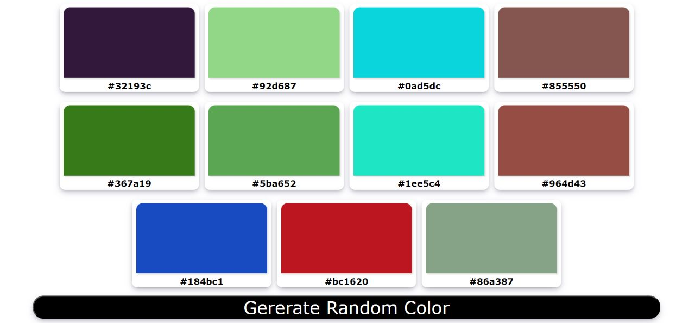

<picture>
  
</picture>

# random-color-generator
This is a Random color generator which is made using in HTML, CSS and JavaScript.
in javascript code i used ordinary methods to get output. you can use some for loop for target and change background color
and you can also use tostring() method instead of for loop to get hexcode which reduce your code
